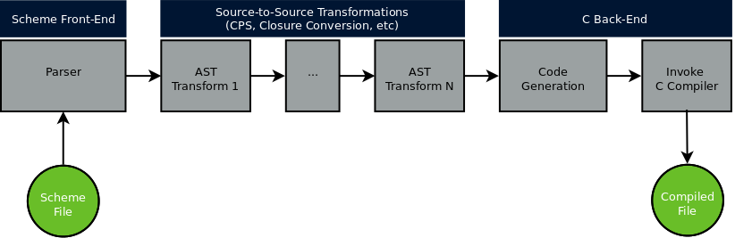
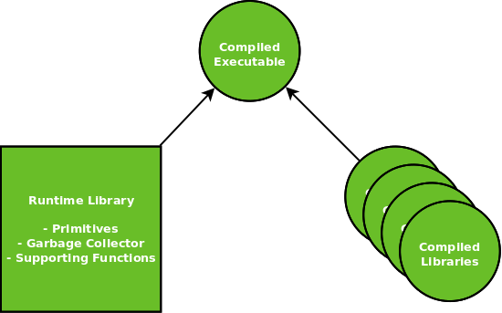

** This document is incomplete and a work in progress **

# High level design

Cyclone has a similar architecture to other modern compilers:

First, an input file containing Scheme code is received on the command line and loaded into an abstract syntax tree (AST) by Cyclone's parser. From there a series of source-to-source transformations are performed on the AST to expand macros, perform optimizations, and make the code easier to compile to C. These intermediate representations (IR) can be printed out in a readable format to aid debugging. The final AST is then output as a `.c` file and the C compiler is invoked to create the final executable or object file.

Programs are linked with the necessary Scheme libraries and the Cyclone runtime library to create an executable:

For more high-level overview of the project a good place to start is [Writing the Cyclone Scheme Compiler](docs/Writing-the-Cyclone-Scheme-Compiler-Revised-2017.md).

# Code Map

The Cyclone [API Documentation](docs/API.md) provides more details on the individual modules within these directories as well as code-level API documentation.

## scheme/

Code for the built-in Scheme standard libraries lives at the top level of this directory. In general all of the code here is written to conform to the Scheme R7RS specification.

## scheme/cyclone

Scheme code for the Cyclone compiler itself lives here as a set of libraries.

There are front-end programs at the top-level of the Cyclone repository that use these libraries:

- `cyclone.scm` for the compiler
- `icyc.scm` for the interpreter

## srfi/

Implementations of various Scheme SRFI's that are distributed directly with Cyclone.

In general the recommended way to distribute SRFI's is to use the Winds package manager. At this point there would need to be a very good reason to include a new SRFI here in the main Cyclone repository.

## runtime.c

Most of the code for the C runtime lives here including primitives and the minor GC.

Code here is often written in a continuation passing style because Cheney on the MTA is used as the minor garbage collecting mechanism.

TODO: for example

## gc.c

Module for the major garbage collector.

For comprehensive design documentation on the major collector see the [Garbage Collector](Garbage-Collector-Revised-2022.md) documentation.

## mstreams.c

Code for in-memory streams. Some of this is platform-specific.

# Setting up a Development Environment

See the [Development Guide](docs/Development.md).

This includes instructions on building and debugging the compiler.

# Building

# Debugging

TBD: compiler flags, compilation settings, what else?
TODO: just include in dev guide

