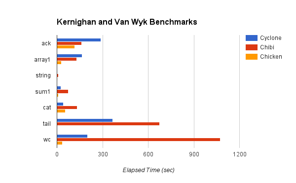
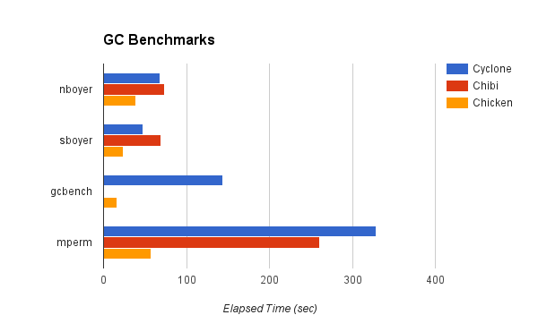

# Benchmarks

The following [benchmarks from Larceny](http://www.larcenists.org/benchmarksGenuineR7Linux.html) give an indication of how well Cyclone performs compared with other R7RS Schemes. These benchmarks were recorded on a system with an Intel Core i5 CPU @ 2.20 GHz and indicate elapsed time in seconds. Longer bars indicate worse performance, although a bar is not displayed if the benchmark could not be completed in a reasonable amount of time.

## Gabriel Benchmarks

Benchmark | Cyclone | Chibi | Chicken
--------- | ------- | ----- | -------
browse    | 58.715  | 439   | 30
deriv     | 32.564  | 212   | 13
destruc   | 125.564 | 197   | 20
diviter   | 15.359  | 122.9 | 8
divrec    | 23.9    | 108   | 29
puzzle    | 147.783 | Timeout     | 32
triangl   | 83.075  | 201   | 26.6
tak       | 72.591  | 105   | 28.9
takl      | 38.987  | Timeout     | 78.7
ntakl     | 38.352  | 193   | 77.9
cpstak    | 87.553  | Timeout     | 35
ctak      | 7.465   | Timeout     | 8.6

## Kernighan and Van Wyk Benchmarks

Benchmark | Cyclone | Chibi | Chicken
--------- | ------- | ----- | -------
ack       | 267.918 | 161   | 116
array1    | 162.611 | 130   | 29.4
string    | 1.068   | 8.478 | 1.584
sum1      | 21.753  | 74    | 7.737
cat       | 36.102  | 132   | 55
tail      | 68.528  | 674   | -
wc        | 176.039 | 1072  | 36.4

## Garbage Collection Benchmarks

Benchmark | Cyclone | Chibi | Chicken
--------- | ------- | ----- | -------
nboyer    | 53.203  | 73.516  | 39.377
sboyer    | 34.873  | 69.243  | 23.628
mperm     | 350.379 | 260.358 | 57.5
