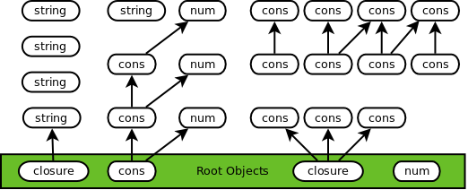
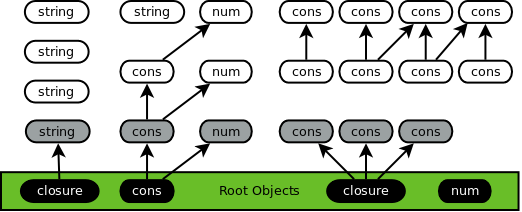
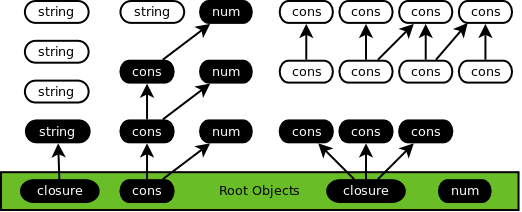
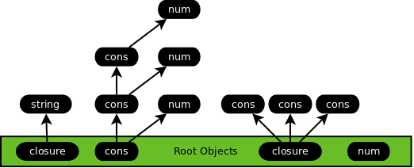

# Garbage Collector

- [Introduction](#introduction)
- [Terms](#terms)
- [Code](#code)
- [Data Structures](#data-structures)
  - [Heap](#heap)
  - [Thread Data](#thread-data)
  - [Object Header](#object-header)
  - [Mark Buffers](#mark-buffers)
- [Minor Collection](#minor-collection)
- [Major Collection](#major-collection)
  - [Lazy Sweeping](#lazy-sweeping)
  - [Object Marking](#object-marking)
  - [Handshakes](#handshakes)
  - [Collection Cycle](#collection-cycle)
  - [Mutator Functions](#mutator-functions)
  - [Collector Functions](#collector-functions)
  - [Cooperation by the Collector](#cooperation-by-the-collector)
  - [Running the Collector](#running-the-collector)
  - [Performance Measurements](#performance-measurements)
- [Conclusion](#conclusion)
- [Further Reading](#further-reading)

# Introduction

This paper provides a high-level overview of Cyclone's garbage collector. 

The collector has the following requirements:

- Efficiently free allocated memory.
- Allow the language implementation to support tail calls and continuations.
- Allow the language to support native multithreading.

Cyclone uses generational garbage collection (GC) to automatically free allocated memory using two types of collection. In practice, most allocations consist of short-lived objects such as temporary variables. Minor GC is done frequently to clean up most of these short-lived objects. Some objects will survive this collection because they are still referenced in memory. A major collection runs less often to free longer-lived objects that are no longer being used by the application.

Cheney on the MTA, a technique introduced by Henry Baker, is used to implement the first generation of our garbage collector. Objects are allocated directly on the stack using `alloca` so allocations are very fast, do not cause fragmentation, and do not require a special pass to free unused objects. Baker's technique uses a copying collector for both the minor and major generations of collection. One of the drawbacks of using a copying collector for major GC is that it relocates all the live objects during collection. This is problematic for supporting native threads because an object can be relocated at any time, invalidating any references to the object. To prevent this either all threads must be stopped while major GC is running or a read barrier must be used each time an object is accessed. Both options add a potentially significant overhead so instead another type of collector is used for the second generation.

Cyclone supports native threads by using a tracing collector based on the Doligez-Leroy-Gonthier (DLG) algorithm for major collections. An advantage of this approach is that objects are not relocated once they are placed on the heap. In addition, major GC executes asynchronously so threads can continue to run concurrently even during collections.

For more background there are introductory articles on garbage collection in the [further reading section](#further-reading) that discuss underlying concepts and that are worthwhile to read in their own right.

# Terms
- Collector - A thread running the garbage collection code. The collector is responsible for coordinating and performing most of the work for major garbage collections.
- Continuation - With respect to the collectors, this is a function that is called to resume execution of application code. For more information see [this article on continuation passing style](https://en.wikipedia.org/wiki/Continuation-passing_style).
- Forwarding Pointer - When a copying collector relocates an object it leaves one of these pointers behind with the object's new address.
- Garbage Collector (GC) - A form of automatic memory management that frees memory allocated by objects that are no longer used by the program.
- Heap - A section of memory used to store longer-lived variables. In C, heap memory is allocated using built-in functions such as `malloc`, and memory must be explicitly deallocated using `free`.
- Mutation - A modification to an object. For example, changing a vector (array) entry.
- Mutator - A thread running user (or "application") code; there may be more than one mutator running concurrently.
- Read Barrier - Code that is executed before reading an object. Read barriers have a larger overhead than write barriers because object reads are much more common.
- Root - During tracing the collector uses these objects as the starting point to find all reachable data.
- Stack - The C call stack, where local variables are allocated and freed automatically when a function returns. Stack variables only exist until the function that created them returns, at which point the memory may be overwritten. The stack has a very limited size and undefined behavior (usually a crash) will result if that size is exceeded.
- Sweep - A phase of garbage collection where the heap - either the whole heap or a subset - is scanned and any unused slots are made available for new allocations.
- Tracing - A phase of garbage collection that visits and marks all live objects on the heap. This is done by starting from a set of "root" objects and iteratively following references to child objects.
- Write Barrier - Code that is executed before writing to an object.

# Code

The implementation code is available here:

- [`runtime.c`](../runtime.c) contains most of the runtime system, including code to perform minor GC. A good place to start would be the `GC` and `gc_minor` functions.
- [`gc.c`](../gc.c) contains the major GC code.

# Data Structures

## Heap

The heap is used to store all objects that survive minor GC, and consists of a linked list of pages. Each page contains a contiguous block of memory and a linked list of free chunks. When a new chunk is requested the first free chunk large enough to meet the request is found and either returned directly or carved up into a smaller chunk to return to the caller.

Memory is always allocated in multiples of 32 bytes. On the one hand this helps prevent external fragmentation by allocating many objects of the same size. But on the other it incurs internal fragmentation because an object will not always fill all of its allocated memory.

A separate set of heap pages is maintained by each mutator thread. Thus there is no need to lock during allocation or sweep operations.

If there is not enough free memory to fulfill a request a new page is allocated and added to the heap. This is the only choice, unfortunately. The collection process is asynchronous so memory cannot be freed immediately to make room.

## Thread Data

At runtime Cyclone passes the current continuation, number of arguments, and a thread data parameter to each compiled C function. The continuation and arguments are used by the application code to call into its next function with a result. Thread data is a structure that contains all of the necessary information to perform collections, including:

- Thread state
- Stack boundaries
- Jump buffer
- List of mutated objects detected by the minor GC write barrier
- Major GC parameters - mark buffer, last read/write, etc (see next sections)
- Call history buffer
- Exception handler stack

Each thread has its own instance of the thread data structure and its own stack (assigned by the C runtime/compiler).

## Object Header

Each object contains a header with the following information:

- Tag - A number indicating the object type: cons, vector, string, etc.
- Mark - The status of the object's memory.
- Grayed - A field indicating the object has been grayed but has not been added to a mark buffer yet (see major GC sections below). This is only applicable for objects on the stack.

## Mark Buffers

Mark buffers are used to hold gray objects instead of explicitly marking objects gray. These mark buffers consist of fixed-size pointer arrays that are increased in size as necessary using `realloc`.  Each mutator has a reference to a mark buffer holding their gray objects. A last write variable is used to keep track of the buffer size.

The collector updates the mutator's last read variable each time it marks an object from the mark buffer. Marking is finished when last read and last write are equal. The collector also maintains a single mark stack of objects that the collector has marked gray.

An object on the stack cannot be added to a mark buffer because the reference may become invalid before it can be processed by the collector.

# Minor Collection

For minor collections cyclone uses a copying collector algorithm based on Cheney on the MTA.

A minor GC is always performed for a single mutator thread. Each thread uses local stack storage for its own objects so there is no need for minor GC to synchronize with other mutator threads.

Cyclone converts the original program to continuation passing style (CPS) and compiles it as a series of C functions that never return. At runtime each mutator periodically checks to see if its stack has exceeded a certain size. When this happens a minor GC is started and all live stack objects are copied to the heap.

The following root objects are used as a starting point to find all live objects:

- The current continuation
- Arguments to the current continuation
- Mutations contained in the write barrier
- Closures from the exception stack
- Global variables

The collection algorithm itself operates as follows:

- Move any root objects on the stack to the heap. For each object moved: 
  - Replace the stack object with a forwarding pointer. The forwarding pointer ensures all references to a stack object refer to the same heap object, and allows minor GC to handle cycles.
  - Record each moved object in a buffer to serve as the Cheney to-space.
- Loop over the to-space buffer and check each object moved to the heap. Move any child objects that are still on the stack. This loop continues until all live objects are moved.
- [Cooperate](#cooperate) with the major GC's collection thread.
- Perform a `longjmp` to reset the stack and call into the current continuation.

Any objects left on the stack after `longjmp` are considered garbage. There is no need to clean them up because the stack will just re-use the memory as it grows.

## Write Barrier for Heap Object References

Baker's paper does not mention one important detail. A heap object can be modified to contain a reference to a stack object. For example, by using a `set-car!` to change the head of a list:

TODO: diagram?

This is problematic since stack references are no longer valid after a minor GC and the GC does not check heap objects. We account for these mutations by using a write barrier to maintain a list of each modified object. During GC these modified objects are treated as roots to avoid dangling references.

The write barrier must be called by each primitive in the runtime that modifies object pointers - `set-car!`, `set-cdr!`, `vector-set!`, etc. Fortunately there are only a handful of these functions.

## Write Barrier to Guarantee Thread Safety

Cyclone must guarantee the objects located on each mutator thread's stack are only used by that thread. 

This requirement is critical as any existing references to a stack object will become invalid when that object is moved to the heap by minor GC. Without the proper safety measures in place this would lead to the potential for memory safety issues - segmentation faults, undefined behavior, etc.

Thus Cyclone ensures memory safety by automatically relocating objects to the heap before they can be accessed by more than one thread. Each write barrier checks to see if a heap variable is being changed to point to a variable on the stack. When such a change is detected Cyclone will move only that object to the heap if possible. However for objects with many children - such as a list or vector - it may be necessary for Cyclone to trigger a minor collection in order to ensure all objects are relocated to the heap before they can be accessed by multiple threads. The following function does the heavy lifting:

    object transport_stack_value(gc_thread_data *data, object var, object value, int *run_gc) 
    {
      char tmp;
      int inttmp, *heap_grown = &inttmp;
      gc_heap_root *heap = data->heap;
    
      // Nothing needs to be done unless we are mutating
      // a heap variable to point to a stack var.
      if (!gc_is_stack_obj(&tmp, data, var) && gc_is_stack_obj(&tmp, data, value)) {
        // Must move `value` to the heap to allow use by other threads
        switch(type_of(value)) {
          case string_tag:
          case bytevector_tag:
            if (immutable(value)) {
              // Safe to transport now
              object hp = gc_alloc(heap, gc_allocated_bytes(value, NULL, NULL), value, data, heap_grown);
              return hp;
            }
            // Need to GC if obj is mutable, EG: a string could be mutated so we can't
            // have multiple copies of the object running around
            *run_gc = 1;
            return value;
          case double_tag:
          case port_tag:
          case c_opaque_tag:
          case complex_num_tag: {
            // These objects are immutable, transport now
            object hp = gc_alloc(heap, gc_allocated_bytes(value, NULL, NULL), value, data, heap_grown);
            return hp;
          }
          // Objs w/children force minor GC to guarantee everything is relocated:
          case cvar_tag:
          case closure0_tag:
          case closure1_tag:
          case closureN_tag:
          case pair_tag:
          case vector_tag:
            *run_gc = 1;
            return value;
          default:
            // Other object types are not stack-allocated so should never get here
            printf("Invalid shared object type %d\n", type_of(value));
            exit(1);
        }
      }
    
      return value;
    }

Then, `transport_stack_value` is called from each write barrier in a manner similar to the below for `set-car!`:

    int do_gc = 0;
    val = transport_stack_value(data, l, val, &do_gc);
    ...
    if (do_gc) { // GC and then do assignment
      mclosure0(clo, (function_type)Cyc_set_car_cps_gc_return);
      object buf[3]; buf[0] = l; buf[1] = val; buf[2] = cont;
      GC(data, &clo, buf, 3);
      return NULL;
    }

It is still necessary for application code to use the appropriate concurrency constructs - such as locks, atomics, etc - to ensure that a shared object is safely accessed by only one thread at a time.

# Major Collection

Major collections are used to reclaim unused heap memory. A collector thread is used to perform a major GC with cooperation from the mutator threads.

## Lazy Sweeping

A fundamental mark-sweep optimization suggested by the [Garbage Collection Handbook](#further-reading) is lazy sweeping.

In a simple mark-sweep collector the entire heap is swept at once when tracing is finished. Instead with lazy sweeping each mutator thread will sweep its own heap incrementally as part of allocation. When no more free space is available to meet a request the allocator will check to see if there are unswept heap pages, and if so, the mutator will pick a page and sweep it to free up space. This amortizes the cost of sweeping.

Performance is improved in several ways:

- Better Locality - Heap slots tend to be used soon after they are swept and sweep only needs to visit a small part of the heap. This allows programs to make better use of the processor cache.
- Thread-Local Data - There is no need to lock the heap for allocation or sweeping since both operations are performed by the same thread.
- Reduced Complexity - The algorithmic complexity of mark-sweep is reduced to be proportional to the size of the live data in the heap instead of the whole heap, similar to a copying collector. Lazy sweeping will perform best when most of the heap is empty.

Lazy sweeping is discussed first as it impacts many other components of the collector.

## Object Marking

An object can be marked using any of the following colors to indicate the status of its memory:

  - Blue - Unallocated memory.
  - Red - An object on the stack.
  - White - Heap memory that has not been scanned by the collector. 
  - Gray - Objects marked by the collector that may still have child objects that must be marked.
  - Black - Objects marked by the collector whose immediate child objects have also been marked.
  - Purple - Garbage objects on the heap that have not yet been reclaimed due to lazy sweeping.

### Tri-Color Invariant

Only objects marked as white, gray, or black participate in major collections. 

White objects are freed during the sweep state. White is sometimes also referred to as the clear color.

Black objects survive the collection cycle. Black is sometimes referred to as the mark color as live objects are ultimately marked black.

Our collector must guarantee that a black object never has any children that are white objects. This satisfies the so-called tri-color invariant and guarantees that all white objects can be collected once the gray objects are marked. This is the reason our collector must use a gray color instead of transitioning white objects directly to black.

Finally, as noted previously a [mark buffer](#mark-buffers) is used to store the list of gray objects. This improves performance by avoiding repeated passes over the heap to search for gray objects.

## Deferred Collection

The current set of colors is insufficient for lazy sweeping because parts of the heap may not be swept during a collection cycle. Thus an object that is really garbage could accidentally be assigned the black color.

For example, suppose a heap page consists entirely of white objects after a GC is finished. All of the objects are garbage and would be freed if the page is swept. However if this page is not swept before the next collection starts, the collector will [swap the values of white/black](#clear) and during the subsequent cycle all of the objects will appear as if they have the black color. Thus a sweep during this most recent GC cycle would not be able to free any of the objects!

The solution is to add a new color (purple) to indicate garbage objects on the heap. Garbage can then be swept while the collector is busy doing other work such as mark/trace. In order to account for multiple generations of objects the object colors are incremented each cycle instead of being swapped. For example, the collector starts in the following state:

    static unsigned char gc_color_mark = 5;   // Black, is swapped during GC
    static unsigned char gc_color_clear = 3;  // White, is swapped during GC
    static unsigned char gc_color_purple = 1;  // There are many "shades" of purple, this is the most recent one

We can assign a new purple color after tracing is finished. At this point the clear color and the purple color are (essentially) the same, and any new objects are allocated using the mark color. When GC starts back up, the clear and mark colors are each incremented by 2:

    // We now increment both so that clear becomes the old mark color and a
    // new value is used for the mark color. The old clear color becomes
    // purple, indicating any of these objects are garbage
    ck_pr_add_8(&gc_color_purple, 2);
    ck_pr_add_8(&gc_color_clear, 2);
    ck_pr_add_8(&gc_color_mark, 2);

So we now have purple (assigned the previous clear color), clear (assigned the previous mark color), and mark (assigned a new number). All of these numbers must be odd so they will never conflict with the red or blue colors. Effectively any odd numbered colors not part of this set represent other "shades" of purple.

## Handshakes

Instead of stopping the world and pausing all threads, when the collector needs to coordinate with the mutators it performs a handshake.

Each of the mutator threads, and the collector itself, has a status variable:

     typedef enum { STATUS_ASYNC 
                  , STATUS_SYNC1 
                  , STATUS_SYNC2 
                  } gc_status_type;

The collector will update its status variable and then wait for all of the collectors to change their status before continuing. The mutators periodically call a cooperate function to check in and update their status to match the collectors. A handshake is complete once all mutators have updated their status.

## Collection Cycle

During a GC cycle the collector thread transitions through the following states.

### Clear
The collector swaps the values of the clear color (white) and the mark color (black). This is more efficient than modifying the color on each object in the heap. The collector then transitions to sync 1. At this point no heap objects are marked, as demonstrated below:

### Mark
The collector transitions to sync 2 and then async. At this point it marks the global variables and waits for the mutators to also transition to async. When a mutator transitions it will mark its roots and use black as the allocation color to prevent any new objects from being collected during this cycle:

### Trace
The collector finds all live objects using a breadth-first search and marks them black:

This is the slowest phase of collection as all objects in memory must be visited. In addition the object access pattern is across all of memory which makes poor use of the processor cache and may impact performance. As a result it is helpful that this work is performed by the collector thread rather than directly holding up mutator threads.

### Sweep
This function is included here for completeness but is actually performed much later due to [lazy sweeping](#lazy-sweeping).

When the time comes to reclaim memory a mutator scans a heap page and frees memory used by any of the white objects:

### Resting
The collector cycle is complete and it rests until it is triggered again.

## Mutator Functions

Each mutator calls the following functions to coordinate with the collector.

### Allocate

This function is called by a mutator to allocate memory on the heap for an object. This is generally only done during a minor GC when each object is relocated to the heap.

There is no need for the mutator to directly coordinate with the collector during allocation as each thread uses its own set of heap pages.

The main allocation function takes a fast or slow path depending upon whether a free slot is found on the current heap page. 

The logic in simplified form is:

    result = try_alloc();
    if (result)
      return result;

    result = try_alloc_slow();
    if (result) 
      return result;

    grow_heap(); // malloc more heap space
    result = try_alloc_slow();
    if (result) 
      return result;

    out_of_memory_error();
  
A heap page uses a "free list" of available slots to quickly find the next available slot. The `try_alloc` function simply finds the first slot on the free list and returns it, or `NULL` if there is no free slot.

On the other hand, `try_alloc_slow` has to do more work to find the next available heap page, sweep it, and then call `try_alloc` to perform an allocation.

### Sweep

Sweep walks an entire heap page, freeing all unused slots along the way. 

To identify an unused object the algorithm must check for two colors:

- Objects that are either newly-allocated or recently traced are given the allocation color; we need to keep them.
- If the collector is currently tracing, objects not traced yet will have the trace/clear color. We need to keep any of those to make sure the collector has a chance to trace the entire heap.

      if (mark(p) != thd->gc_alloc_color && 
          mark(p) != thd->gc_trace_color) {
        ... // Free slot p
      }

### Update

A write barrier is used to ensure any modified objects are properly marked for the current collection cycle. There are two cases:

- Gray the object's new and old values if the mutator is in a synchronous status. 
- Gray the object's old value if the collector is in the tracing stage.

Because updates can occur at any time a modified object may still live on the stack. In this case the object is tagged to be grayed when it is relocated to the heap.

### Cooperate

Each mutator is required to periodically call this function to cooperate with the collector. During cooperation a mutator will update its status to match the collector's status, to handshake with the collector. 

In addition when a mutator transitions to async it will:

- Mark all of its roots gray
- Use black as the allocation color for any new objects to prevent them from being collected during this cycle.

Cyclone's mutators cooperate after each minor GC, for two reasons. Minor GC's are frequent and immediately afterwards all of the mutator's live objects can be marked because they are on the heap.

Finally, at the end of a collection cycle the main thread must clean up heap data for any terminated threads.

### Mark Gray

Mutators call this function to add an object to their mark buffer.

    mark_gray(m, obj):
      if obj != clear_color:
        m->mark_buffer[m->last_write] = obj
        m->last_write++

## Collector Functions

### Collector Mark Gray

The collector calls this function to add an object to the mark stack.

    collector_mark_gray(obj):
      if obj != clear_color:
        mark_stack->push(obj)

### Mark Black

The collector calls this function to mark an object black and mark all of the object's children gray using Collector Mark Gray.

    mark_black(obj):
      if mark(obj) != mark_color:
        for each child(c):
          collector_mark_gray(c)
        mark(obj) = mark_color

### Empty Collector Mark Stack

This function removes and marks each object on the collector's mark stack.

    empty_collector_mark_stack():
      while not mark_stack->empty():
        mark_black(mark_stack->pop())

### Collector Trace

This function performs tracing for the collector by looping over all of the mutator mark buffers. All of the remaining objects in each buffer are marked black, as well as all the remaining objects on the collector's mark stack. This function continues looping until there are no more objects to mark:

    collector_trace():
      clean = 0
      while not clean:
        clean = 1
        for each mutator(m):
          while m->last_read < m->last_write:
            clean = 0
            mark_black(m->mark_buffer[m->last_read])
            empty_collector_mark_stack()
            m->last_read++

## Cooperation by the Collector

In practice a mutator will not always be able to cooperate in a timely manner. For example, a thread can block indefinitely waiting for user input or reading from a network port. In the meantime the collector will never be able to complete a handshake with this mutator and major GC will never be performed.

Cyclone solves this problem by requiring that a mutator keep track of its thread state. With this information the collector can cooperate on behalf of a blocked mutator and do the work itself instead of waiting for the mutator. 

The possible thread states are:

- `CYC_THREAD_STATE_NEW` - A new thread not yet running.
- `CYC_THREAD_STATE_RUNNABLE` - A thread that can be scheduled to run by the OS.
- `CYC_THREAD_STATE_BLOCKED` - A thread that could be blocked.
- `CYC_THREAD_STATE_BLOCKED_COOPERATING` - A blocked thread that the collector is cooperating with on behalf of the mutator.
- `CYC_THREAD_STATE_TERMINATED` - A thread that has been terminated by the application but its resources have not been freed up yet.

Before entering a C function that could block the mutator must call a function to update its thread state to `CYC_THREAD_STATE_BLOCKED`. This indicates to the collector that the thread may be blocked.

When the collector handshakes it will check each mutator to see if it is blocked. Normally in this case the collector can just update the blocked mutator's status and move on to the next one. But if the mutator is transitioning to async all of its objects need to be relocated from the stack so they can be marked. In this case the collector changes the thread's state to `CYC_THREAD_STATE_BLOCKED_COOPERATING`, locks the mutator's mutex, and performs a minor collection for the thread. The mutator's objects can then be marked gray and its allocation color can be flipped. When it is finished cooperating for the mutator the collector releases its mutex.

When a mutator exits a (potentially) blocking section of code, it must call another function to update its thread state to `CYC_THREAD_STATE_RUNNABLE`. In addition, the function will detect if the collector cooperated for this mutator by checking if its status is `CYC_THREAD_STATE_BLOCKED_COOPERATING`. If so, the mutator waits for its mutex to be released to ensure the collector has finished cooperating. The mutator then performs a minor GC again to ensure any additional objects - such as results from the blocking code - are moved to the heap before calling `longjmp` to jump back to the beginning of its stack. Either way, the mutator now calls into its continuation and resumes normal operations.

## Running the Collector

Cyclone checks the amount of free memory as part of its cooperation code. A major GC cycle is started if the amount of free memory dips below a threshold. 

Additionally, during a slow allocation the mutator checks how many heap pages are still free. If that number is too low we trigger a new GC cycle.

The goal is to run major collections infrequently while at the same time minimizing the allocation of new heap pages.

### Collector Thread

As well as coordinating major GC the main job of the collector thread is now just tracing. 

During this phase the collector visits all live objects and marks them as being in use. Since these objects are stored all across the heap the tracing algorithm cannot take advantage of object locality and tends to demonstrate unusual memory access patterns, leading to inefficient use of the processor cache and poor performance. This makes tracing an excellent task to be done in parallel with the mutator threads so it does not slow down application code.

Note that during tracing some synchronization is required between the collector and the mutator threads. When an object is changed (EG via: `set!`, `vector-set!`, etc) the mutator needs to add this object to the mark stack, which requires a mutex lock to safely update shared resources.

# Performance Measurements

A [benchmark suite](#further-reading) was used to compare performance between the previous version of Cyclone (0.8.1) and the new version with lazy sweeping.

The following table lists the differences in elapsed time (seconds) between versions:

Benchmark | Baseline | Lazy Sweeping | Improvement
--------- | -------- | ------------- | ------------
browse | 25.34 | 22.21 | 12.35%
deriv | 17.17 | 10.83 | 36.90%
destruc | 38.00 | 30.94 | 18.59%
diviter | 8.57 | 6.05 | 29.35%
divrec | 17.98 | 14.49 | 19.46%
puzzle | 46.97 | 44.97 | 4.25%
triangl | 26.20 | 25.35 | 3.23%
tak | 18.73 | 18.36 | 1.99%
takl | 14.42 | 11.30 | 21.64%
ntakl | 15.32 | 11.22 | 26.74%
cpstak | 21.09 | 20.92 | 0.80%
ctak | 2.78 | 2.77 | 0.28%
fib | 41.26 | 41.05 | 0.51%
fibc | 3.52 | 3.47 | 1.37%
fibfp | 9.56 | 9.57 | -0.12%
sum | 30.28 | 30.29 | -0.02%
sumfp | 11.55 | 11.53 | 0.23%
fft | 21.19 | 17.25 | 18.57%
mbrot | 16.84 | 15.27 | 9.34%
mbrotZ | 23.35 | 22.88 | 2.01%
nucleic | 8.29 | 7.91 | 4.56%
pi | 0.13 | 0.13 | 1.90%
pnpoly | 43.64 | 41.80 | 4.22%
ray | 9.13 | 9.12 | 0.05%
simplex | 53.26 | 42.60 | 20.02%
ack | 75.78 | 50.64 | 33.18%
array1 | 30.84 | 30.65 | 0.60%
string | 0.28 | 0.26 | 6.91%
sum1 | 1.01 | 1.00 | 1.23%
cat | 22.05 | 22.42 | -1.69%
tail | 1.04 | 0.99 | 4.56%
wc | 14.46 | 14.75 | -2.07%
read1 | 3.61 | 3.20 | 11.31%
conform | 40.67 | 34.00 | 16.40%
dynamic | 33.84 | 27.61 | 18.41%
earley | 31.49 | 26.84 | 14.78%
graphs | 64.84 | 55.22 | 14.84%
lattice | 84.57 | 68.93 | 18.50%
matrix | 61.07 | 48.46 | 20.64%
maze | 23.02 | 18.46 | 19.79%
mazefun | 23.73 | 20.74 | 12.61%
nqueens | 47.92 | 45.18 | 5.71%
paraffins | 15.21 | 10.76 | 29.28%
parsing | 39.50 | 38.55 | 2.41%
peval | 32.11 | 27.72 | 13.67%
primes | 18.79 | 12.83 | 31.74%
quicksort | 56.64 | 48.13 | 15.03%
scheme | 23.32 | 21.39 | 8.30%
slatex | 9.74 | 8.14 | 16.37%
chudnovsky | 0.09 | 0.09 | 1.79%
nboyer | 13.80 | 11.84 | 14.24%
sboyer | 11.90 | 12.09 | -1.60%
gcbench | 37.12 | 32.37 | 12.79%
mperm | 49.94 | 39.97 | 19.95%
equal | 0.74 | 0.70 | 4.43%
bv2string | 7.54 | 7.62 | -1.00%

This data is illustrated in the following chart:

Here is an overall summary:

Statistic | Benchmark | Result
--------- | --------- | ------
Overall Improvement | N/A |  13.36%
Average Speedup     | N/A |  10.74%
Maximum Speedup     | deriv |  36.90%
Minimum Speedup     | wc |  -2.07%

Overall we achieve an average speedup of 10.74% with lazy sweeping. That said there are a wide range of performance impacts across the whole benchmark suite. 

Those benchmarks with the biggest speedups are likely those that are generating the most garbage. For example `ack` frequently invokes GC and most of the heap is freed during each GC cycle - this benchmark benefits greatly from lazy sweeping. Alternatively `wc` - which did not realize a speedup - spends most of its time running in a tight loop, invokes GC infrequently, and after a GC cycle there are many live objects left on the heap. 

By all accounts lazy sweeping is a great win for Cyclone and has exceeded performance expectations. Though there is a slight performance overhead that affects some programs the overall performance improvement across a wide range of programs more than compensates. 

Lazy sweeping is a large-scale change that took a few months to fully-integrate into Cyclone. Although there is work involved to re-stabilize the GC code after such a significant change, this does open up the possibility to experiment with future larger-scale GC optimizations.

# Conclusion

The garbage collector is by far the most complex component of Cyclone. The primary motivations in developing it were to:

- Extend baker's approach to support multiple mutators
- Position to potentially support state of the art GC's built on top of DLG (Stopless, Chicken, Clover)

There are a few limitations or potential issues with the current implementation:

- Heap memory fragmentation has not been addressed and could be an issue for long-running programs. Traditionally a compaction process is used to defragment a heap. An alternative strategy has also been suggested by Pizlo:

    > instead of copying objects to evacuate fragmented regions of the heap, fragmentation is instead embraced. A fragmented heap is allowed to stay fragmented, but the collector ensures that it can still satisfy allocation requests even if no large enough contiguous free region of space exists.

- Accordingly, the runtime needs to be able to handle large objects that could potentially span one or more pages.

Cyclone needs to be tested with large heap and large allocations. I believe it should work well for large heaps that do not allocate too many objects of irregular size. However, a program regularly allocating large strings or vectors could cause significant heap fragmentation over time.

Ultimately, a garbage collector is tricky to implement and the focus must primarily be on correctness first, with an eye towards performance.

# Further Reading

- [Baby's First Garbage Collector](http://journal.stuffwithstuff.com/2013/12/08/babys-first-garbage-collector/), by Bob Nystrom
- [Chibi-Scheme](https://github.com/ashinn/chibi-scheme)
- [CHICKEN internals: the garbage collector](http://www.more-magic.net/posts/internals-gc.html), by Peter Bex
- [CONS Should Not CONS Its Arguments, Part II: Cheney on the M.T.A.](https://github.com/justinethier/cyclone/raw/master/docs/research-papers/CheneyMTA.pdf), by Henry Baker
- Fragmentation Tolerant Real Time Garbage Collection (PhD Dissertation), by Filip Pizlo
- [The Garbage Collection Handbook: The Art of Automatic Memory Management](http://gchandbook.org/), by Antony Hosking, Eliot Moss, and Richard Jones
- Implementing an on-the-fly garbage collector for Java, by Domani et al
- Incremental Parallel Garbage Collection, by Paul Thomas
- Portable, Unobtrusive Garbage Collection for Multiprocessor Systems, by Damien Doligez and Georges Gonthier
- [Introducing Riptide: WebKit's Retreating Wavefront Concurrent Garbage Collector](https://webkit.org/blog/7122/introducing-riptide-webkits-retreating-wavefront-concurrent-garbage-collector/), by Filip Pizlo
- [Scheme Benchmarks](https://ecraven.github.io/r7rs-benchmarks/), by [ecraven](https://github.com/ecraven)
- [The Ramsey sweep](http://people.csail.mit.edu/gregs/ll1-discuss-archive-html/msg00761.html), by Olin Shivers
