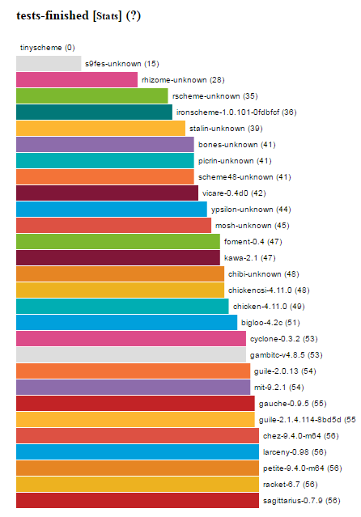
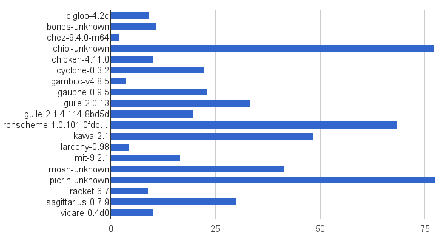

# Writing the Cyclone Scheme Compiler 

## Revised for 2017

###### by [Justin Ethier](https://github.com/justinethier)

This write-up provides a high level background on the various components of Cyclone and how they were written. It is a revision of the [original write-up](Writing-the-Cyclone-Scheme-Compiler.md), written over a year ago in August 2015, when the compiler was self hosting but before the new garbage collector was written. Quite a bit of time has passed since then, so I thought it would be worthwhile to provide a brain dump of sorts for everything that has happened in the last year and half.

Before we get started, I want to say **Thank You** to all of the contributors to the Scheme community. Cyclone is based on the community's latest revision of the Scheme language and wherever possible existing code was reused or repurposed for this project, instead of starting from scratch. At the end of this document is a list of helpful online resources. Without high quality Scheme resources like these the Cyclone project would not have been possible.

## Table of Contents

- [Overview](#overview)
- [Source-to-Source Transformations](#source-to-source-transformations)
  - [Just Make Many Small Passes](#just-make-many-small-passes)
  - [Macro Expansion](#macro-expansion)
  - [CPS Conversion](#cps-conversion)
  - [CPS Optimizations](#cps-optimizations)
  - [Closure Conversion](#closure-conversion)
  - [C Code Generation](#c-code-generation)
  - [Native Compilation](#native-compilation)
- [Garbage Collector](#garbage-collector)
  - [Background: Cheney on the MTA](#background-cheney-on-the-mta)
  - [Cyclone's Hybrid Collector](#cyclones-hybrid-collector)
  - [Major Garbage Collection Algorithm](#major-garbage-collection-algorithm)
  - [Developing the New Collector](#developing-the-new-collector)
  - [Heap Data Structures](#heap-data-structures)
- [C Runtime](#c-runtime)
  - [Data Types](#data-types)
  - [Thread Data Parameter](#thread-data-parameter)
  - [Call History](#call-history)
  - [Exception Handling](#exception-handling)
- [Scheme Libraries](#scheme-libraries)
  - [Native Thread Support](#native-thread-support)
  - [Reader](#reader)
  - [Interpreter](#interpreter)
  - [Compiler Internals](#compiler-internals)
- [Scheme Standards](#scheme-standards)
- [Benchmarks](#benchmarks)
- [Future](#future)
- [Conclusion](#conclusion)
- [Terms](#terms)
- [References](#references)

## Overview

Cyclone has a similar architecture to other modern compilers:

First, an input file containing Scheme code is received on the command line and loaded into an abstract syntax tree (AST) by Cyclone's parser. From there a series of source-to-source transformations are performed on the AST to expand macros, perform optimizations, and make the code easier to compile to C. These intermediate representations (IR) can be printed out in a readable format to aid debugging. The final AST is then output as a `.c` file and the C compiler is invoked to create the final executable or object file.

Programs are linked with the necessary Scheme libraries and the Cyclone runtime library to create an executable:

## Source-to-Source Transformations

### Overview

My primary inspiration for Cyclone was Marc Feeley's [The 90 minute Scheme to C compiler](http://churchturing.org/y/90-min-scc.pdf) (also [video](https://youtu.be/Bp89aBm9tGU) and [code](https://github.com/justinethier/nugget/tree/master/90-min-scc)). Over the course of 90 minutes, Feeley demonstrates how to compile Scheme to C code using source-to-source transformations, including closure and continuation-passing-style (CPS) conversions. 

As outlined in the presentation, some of the difficulties in compiling to C are:

> Scheme has, and C does not have
>
>  -  tail-calls a.k.a. tail-recursion optimization
>  -  first-class continuations
>  -  closures of indefinite extent
>  -  automatic memory management i.e. garbage collection (GC)
>
> Implications
>
>  -  cannot translate (all) Scheme calls into C calls
>  -  have to implement continuations
>  -  have to implement closures
>  -  have to organize things to allow GC
>
> The rest is easy!

To overcome these difficulties a series of source-to-source transformations are used to remove powerful features not provided by C, add constructs required by the C code, and restructure/relabel the code in preparation for generating C. The final code may be compiled direcly to C. Cyclone also includes many other intermediate transformations, including:

- Macro expansion
- Processing of globals
- [Alpha conversion](https://wiki.haskell.org/Alpha_conversion)
- [CPS conversion](https://en.wikipedia.org/wiki/Continuation-passing_style)
- [Closure conversion](http://matt.might.net/articles/closure-conversion/)

The 90-minute compiler ultimately compiles the code down to a single function and uses jumps to support continuations. This is a bit too limiting for a production compiler, so that part was not used.

### Just Make Many Small Passes

To make Cyclone easier to maintain a separate pass is made for each transformation. This allows Cyclone's code to be as simple as possible and minimizes dependencies so there is less chance of changes to one transformation breaking the code for another.

Internally Cyclone represents the code being compiled as an AST of regular Scheme objects.  Since Scheme represents both code and data using [S-expressions](https://en.wikipedia.org/wiki/S-expression), our compiler does not (in general) have to use custom abstract data types to store the code as would be the case with many other languages.

Most of the transformations follow a similar pattern of recursively examining an expression. Here is a short example that demonstrates the code structure:

    (define (search exp)
      (cond
        ((const? exp)    '())
        ((prim? exp)     '())    
        ((quote? exp)    '())    
        ((ref? exp)      (if bound-only? '() (list exp)))
        ((lambda? exp)   
          (difference (reduce union (map search (lambda->exp exp)) '())
                      (lambda-formals->list exp)))
        ((if-syntax? exp)  (union (search (if->condition exp))
                                (union (search (if->then exp))
                                       (search (if->else exp)))))
        ((define? exp)     (union (list (define->var exp))
                                (search (define->exp exp))))
        ((define-c? exp) (list (define->var exp)))
        ((set!? exp)     (union (list (set!->var exp)) 
                                (search (set!->exp exp))))
        ((app? exp)       (reduce union (map search exp) '()))
        (else             (error "unknown expression: " exp))))

The [Nanopass Framework](https://github.com/nanopass/nanopass-framework-scheme) was created to make it easier to write a compiler that makes many small passes over the code. Unfortunately Nanopass itself is written in R6RS and could not be used for this project.

### Macro Expansion

Macro expansion is one of the first transformations. Any macros the compiler knows about are loaded as functions into a macro environment, and a single pass is made over the code. When the compiler finds a macro the code is expanded by calling the macro. The compiler then inspects the resulting code again in case the macro expanded into another macro.

At the lowest level, Cyclone's [explicit renaming](http://wiki.call-cc.org/explicit-renaming-macros) (ER) macros provide a simple, low-level macro system that does not require much more than `eval`. Many ER macros from [Chibi Scheme](https://github.com/ashinn/chibi-scheme) are used to implement the built-in macros in Cyclone.

Cyclone also supports the high-level `syntax-rules` system from the Scheme reports. Syntax rules is implemented as [a huge ER macro](https://github.com/justinethier/cyclone/blob/v0.3.3/scheme/base.sld#L1242) ported from Chibi Scheme.

As a simple example the `let` macro below:

    (let ((square (lambda (x) (* x x))))
      (write (+ (square 10) 1)))

is expanded to:

    (((lambda (square) (write (+ (square 10) 1)))
      (lambda (x) (* x x))))

### CPS Conversion

The conversion to continuation passing style (CPS) makes continuations explicit in the compiled code. This is a critical step to make the Scheme code simple enough that it can be represented by C. As we will see later, the runtime's garbage collector also requires code in CPS form.

The basic idea is that each expression will produce a value that is consumed by the continuation of the expression. Continuations will be represented using functions. All of the code must be rewritten to accept a new continuation parameter `k` that will be called with the result of the expression. For example, considering the previous `let` example:

    (((lambda (square) (write (+ (square 10) 1)))
      (lambda (x) (* x x))))
    
the code in CPS form becomes:

    ((lambda (r)
       ((lambda (square)
          (square
            (lambda (r)
              ((lambda (r) (write r))
               (+ r 1)))
            10))
        r))
     (lambda (k x) (k (* x x))))

### CPS Optimizations

CPS conversion generates too much code and is inefficient for functions such as primitives that can return a result directly instead of calling into a continuation. So we need to optimize it to make the compiler practical. For example, the previous CPS code can be simplified to:

    ((lambda (k x) (k (* x x)))
      (lambda (r)
        (write (+ r 1)))
      10)

One of the most effective optimizations is inlining of primitives. That is, some runtime functions can be called directly, so an enclosing `lambda` is not needed to evaluate them. This can greatly reduce the amount of generated code.

A contraction phase is also used to eliminate other unnecessary `lambda`'s. There are a few other miscellaneous optimizations such as constant folding, which evaluates certain primitives at compile time if the parameters are constants.

To more efficiently identify optimizations Cyclone first makes a code pass to build up an hash table-based analysis database (DB) of various attributes. This is the same strategy employed by CHICKEN, although each compiler records different attributes. The DB contains a table of records with an entry for each variable (indexed by symbol) and each function (indexed by unique ID).

In order to support the analysis DB a custom AST is used to represent functions during this phase, so that each one can be tagged with a unique identification number. After optimizations are complete, the lambdas are converted back into regular S-expressions.

### Closure Conversion

Free variables passed to a nested function must be captured in a closure so they can be referenced at runtime. The closure conversion transformation modifies lambda definitions as necessary to create new closures. It also replaces free variable references with lookups from the current closure.

Cyclone uses flat closures: objects that contain a single function reference and a vector of free variables. This is a more efficient representation than an environment as only a single vector lookup is required to read any of the free variables.

Mutated variables are not directly supported by flat closures and must be added to a pair (called a "cell") by a separate compilation pass prior to closure conversion.

Cyclone's closure conversion is based on code from Marc Feeley's 90 minute Scheme->C compiler and Matt Might's Scheme->C compiler.

### C Code Generation

The compiler's code generation phase takes a single pass over the transformed Scheme code and outputs C code to the current output port (usually a `.c` file).

During this phase C code is sometimes saved for later use instead of being output directly. For example, when compiling a vector literal or a series of function arguments, the code is returned as a list of strings that separates variable declarations from C code in the "body" of the generated function.

The C code is carefully generated so that a Scheme library (`.sld` file) is compiled into a C module. Functions and variables exported from the library become C globals in the generated code.

### Native Compilation

The C compiler is invoked to generate machine code for the Scheme module, and to also create an executable if a Scheme program is being compiled.

## Garbage Collector

### Background: Cheney on the MTA
A runtime based on Henry Baker's paper [CONS Should Not CONS Its Arguments, Part II: Cheney on the M.T.A.](https://github.com/justinethier/cyclone/raw/master/docs/research-papers/CheneyMTA.pdf) was used as it allows for fast code that meets all of the fundamental requirements for a Scheme runtime: tail calls, garbage collection, and continuations.

Baker explains how it works:

> We propose to compile Scheme by converting it into continuation-passing style (CPS), and then compile the resulting lambda expressions into individual C functions. Arguments are passed as normal C arguments, and function calls are normal C calls. Continuation closures and closure environments are passed as extra C arguments. Such a Scheme never executes a C return, so the stack will grow and grow ... eventually, the C "stack" will overflow the space assigned to it, and we must perform garbage collection. 

Cheney on the M.T.A. uses a copying garbage collector. By using static roots and the current continuation closure, the GC is able to copy objects from the stack to a pre-allocated heap without having to know the format of C stack frames. To quote Baker:

> the entire C "stack" is effectively the youngest generation in a generational garbage collector!

After GC is finished, the C stack pointer is reset using [`longjmp`](http://man7.org/linux/man-pages/man3/longjmp.3.html) and the GC calls its continuation. 

Here is a snippet demonstrating how C functions may be written using Baker's approach:

    object Cyc_make_vector(object cont, object len, object fill) {
      object v = NULL;
      int i;
      Cyc_check_int(len);

      // Memory for vector can be allocated directly on the stack
      v = alloca(sizeof(vector_type));

      // Populate vector object
      ((vector)v)->tag = vector_tag;
      ... 

      // Check if GC is needed, then call into continuation with the new vector
      return_closcall1(cont, v);
    }

[CHICKEN](http://www.call-cc.org/) was the first Scheme compiler to use Baker's approach.

### Cyclone's Hybrid Collector 

Baker's technique uses a copying collector for both the minor and major generations of collection. One of the drawbacks of using a copying collector for major GC is that it relocates all the live objects during collection. This is problematic for supporting native threads because an object can be relocated at any time, invalidating any references to the object. To prevent this either all threads must be stopped while major GC is running or a read barrier must be used each time an object is accessed. Both options add a potentially significant overhead so instead Cyclone uses another type of collector for the second generation.

To that end, Cyclone supports uses a tri-color tracing collector based on the Doligez-Leroy-Gonthier (DLG) algorithm for major collections. The DLG algorithm was selected in part because many state-of-the-art collectors are built on top of DLG such as Chicken, Clover, and Schism. So this may allow for further enhancements down the road.

Under Cyclone's runtime each thread contains its own stack that is used for private thread allocations. Thread stacks are managed independently using Cheney on the MTA. Each object that survives one of these minor collections is copied from the stack to a newly-allocated slot on the heap. 

Heap objects are not relocated, making it easier for the runtime to support native threads. In addition major GC uses a collector thread that executes asynchronously so application threads can continue to run concurrently even during collections.

In summary:

- All objects on the stack are collected using Cheney on the MTA, and the ones that survive are placed on the heap.
- Heap objects are collected during Major GC using the DLG algorithm.
- Heap collection runs on a separate thread in parallel with application threads.

### Major Garbage Collection Algorithm

Each object is marked with a specific color (white, gray, or black) that determines how it will be handled during a major collection. Major GC transitions through the following states: 

#### Clear
The collector thread swaps the values of the clear color (white) and the mark color (black). This is more efficient than modifying the color on each object in the heap. The collector then transitions to sync 1. At this point no heap objects are marked, as demonstrated below:

#### Mark
The collector thread transitions to sync 2 and then async. At this point it marks the global variables and waits for the application threads to also transition to async. When an application thread transitions it will:

- Mark its roots black.
- Gray any child objects of the roots. The collector thread traces these gray objects during the next phase.
- Use black as the allocation color to prevent any new objects from being collected during this cycle.

#### Trace
The collector thread finds all live objects using a breadth-first search and marks them black:

#### Sweep
The collector thread scans the heap and frees memory used by all white objects:

If the heap is still low on memory at this point the heap will be increased in size. Also, to ensure a complete collection, data for any terminated threads is not freed until now.

More details are available in a separate [Garbage Collector](Garbage-Collector.md) document.

### Developing the New Collector

It took a long time to research and plan out the new GC before it could be implemented. There was a noticeable lull in Github contributions during that time:

The actual development consisted of several distinct phases:

- Phase 0 - Started with a runtime using a basic Cheney-style copying collector.
- Phase 1 - Added new definitions via `gc.h` and made sure everything compiles.
- Phase 2 - Changed how strings are allocated to clean up the code and be compatible with the new GC algorithm. This was mainly just an exercise in cleaning up cruft in the old Cyclone implementation.
- Phase 3 - Changed major GC from using a Cheney-style copying collector to a naive mark-and-sweep algorithm. The new algorithm was based on code from Chibi Scheme so it was already debugged and would serve as a solid foundation for future work.
- Phase 4 - Integrated code for a new tracing GC algorithm but did not cut over to it yet. Added a new thread data argument to all of the necessary runtime functions - a simple but far-reaching change that affected almost all functions in the runtime and compiled code.
- Phase 5 - Required the pthreads library and stood Cyclone back up using the new GC algorithm for the first time.
- Phase 6 - Added SRFI 18 to support multiple application threads.

### Heap Data Structures

Cyclone allocates heap data one page at a time. Each page is several megabytes in size and can store multiple Scheme objects. Cyclone will start with a small initial page size and gradually allocate larger pages using the Fibonnaci Sequence until reaching a maximum size.

Each page contains a linked list of free objects that is used to find the next available slot for an allocation. An entry on the free list will be split if it is larger than necessary for an allocation; the remaining space will remain in the free list for the next allocation.

Cyclone allocates smaller objects in fixed size heaps to minimize allocation time and prevent heap fragmentation. The runtime also remembers the last page of the heap that was able to allocate memory, greatly reducing allocation time on larger heaps.

The heap data structures and associated algorithms are based on code from Chibi scheme.

## C Runtime

### Overview

The C runtime provides supporting features to compiled Scheme programs including a set of primitive functions, call history, exception handling, and garbage collection.

An interesting observation from R. Kent Dybvig [[11]](#references) that I have tried to keep in mind is that performance optimizations in the runtime can be just as (if not more) important that higher level CPS optimizations:

> My focus was instead on low-level details, like choosing efficient representations and generating good instruction sequences, and the compiler did include a peephole optimizer. High-level optimization is important, and we did plenty of that later, but low-level details often have more leverage in the sense that they typically affect a broader class of programs, if not all programs.

### Data Types

#### Objects

Most Scheme data types are represented as objects that are allocated in heap/stack memory. Each type of object has a corresponding C structure that defines its fields, such as the following one for pairs:

    typedef struct {
      gc_header_type hdr;
      tag_type tag;
      object pair_car;
      object pair_cdr;
    } pair_type;

All objects have:

- A `gc_header_type` field that contains marking information for the garbage collector.
- A tag to identify the object type.
- One or more additional fields containing the actual object data.

#### Value Types

On the other hand, some data types can be represented using 30 bits or less and are stored as value types. The great thing about value types is they do not have to be garbage collected because no extra data is allocated for them. This makes them super efficient for commonly-used data types.

Value types are stored using a common technique that is described in Lisp in Small Pieces (among other places). On many machines addresses are multiples of four, leaving the two least significant bits free. [A brief explanation](http://stackoverflow.com/q/9272526/101258):

> The reason why most pointers are aligned to at least 4 bytes is that most pointers are pointers to objects or basic types that themselves are aligned to at least 4 bytes. Things that have 4 byte alignment include (for most systems): int, float, bool (yes, really), any pointer type, and any basic type their size or larger.

In Cyclone the two least significant bits are used to indicate the following data types:

Binary Bit Pattern | Data Type
------------------ | ---------
00 | Pointer (an object type)
01 | Integer
10 | Character

Booleans are potentially another good candidate for value types. But for the time being they are represented in the runtime using pointers to the constants `boolean_t` and `boolean_f`.

### Thread Data Parameter

At runtime Cyclone passes the current continuation, number of arguments, and a thread data parameter to each compiled C function. The continuation and arguments are used by the application code to call into its next function with a result. Thread data is a structure that contains all of the necessary information to perform collections, including:

- Thread state
- Stack boundaries
- Cheney on the MTA jump buffer
- List of mutated objects detected by the minor GC write barrier
- Parameters for major GC
- Call history buffer
- Exception handler stack

Each thread has its own instance of the thread data structure and its own stack (assigned by the C runtime/compiler).

### Call History

Each thread maintains a circular buffer of call history that is used to provide debug information in the event of an error. The buffer itself consists of an array of pointers-to-strings. The compiler emits calls to runtime function `Cyc_st_add` that will populate the buffer when the program is running. `Cyc_st_add` must be fast as it is called all the time! So it does the bare minimum - update the pointer at the current buffer index and increment the index.

### Exception Handling

A family of `Cyc_rt_raise` functions is provided to allow an exception to be raised for the current thread. These functions gather the required arguments and use `apply` to call the thread's current exception handler. The handler is part of the thread data parameter, so any functions that raise an exception must receive that parameter.

A Scheme API for exception handling is provided as part of R7RS.

## Scheme Libraries

This section describes a few notable parts of [Cyclone's Scheme API](API.md).

### Native Thread Support

A multithreading API is provided based on [SRFI 18](http://justinethier.github.io/cyclone/docs/api/srfi/18). Most of the work to support multithreading is accomplished by the runtime and garbage collector.

Cyclone attempts to support multithreading in an efficient way that minimizes the amount of synchronization among threads. But objects are still copied during minor GC. In order for an object to be shared among threads the application must guarantee the object is no longer on the stack. One solution is for application code to initiate a minor GC before an object is shared with other threads, to guarantee the object will henceforth not be relocated.

### Reader

Cyclone uses a combined lexer / parser to read S-expressions. Input is processed one character at a time and either added to the current token or discarded if it is whitespace, part of a comment, etc. Once a terminating character is read the token is inspected and converted to an appropriate Scheme object. For example, a series of numbers may be converted into an integer.

The full implementation is written in Scheme and located in the `(scheme read)` library.

### Interpreter

The `eval` function is written in Scheme, using code from the [Metacircular Evaluator](https://mitpress.mit.edu/sicp/full-text/book/book-Z-H-26.html#%_sec_4.1) from [SICP](https://mitpress.mit.edu/sicp/full-text/book/book.html) as a starting point.

The interpreter itself is straightforward but there is nice speed up to be had by separating syntactic analysis from execution. It would be interesting see what kind of performance improvements could be obtained by compiling to VM bytecodes or even using a JIT compiler.

The interpreter's full implementation is available in the `(scheme eval)` library, and the `icyc` executable is provided for convenient access to a REPL.

### Compiler Internals

Most of the Cyclone compiler is implemented in Scheme as [a series of libraries](API.md#cyclone-compiler-api).

## Scheme Standards

Cyclone targets the [R7RS-small specification](https://github.com/justinethier/cyclone/raw/master/docs/r7rs.pdf). This spec is relatively new and provides incremental improvements from the popular [R5RS spec](http://www.schemers.org/Documents/Standards/R5RS/HTML/). Library support is the most important new feature but there are also exceptions, system interfaces, and a more consistent API.

## Benchmarks

[ecraven](https://github.com/ecraven) has put together an excellent set of [Scheme benchmarks](http://ecraven.github.io/r7rs-benchmarks/benchmark.html) based on a R7RS suite from the Larceny project. These are the typical benchmarks that many implementations have used over the years, but the remarkable thing here is all of the major implementations are supported, allowing a rare apples-to-apples comparison among all the widely-used Schemes.

Over the past year Cyclone has matured to the point where almost all of the 56 benchmarks will run:

The remaining ones are:

- `mbrotZ` fails because Cyclone does not support complex numbers yet.
- `pi` does not work because Cyclone does not support bignums yet.
- `compiler` passes but returns the wrong result. This will be fun to track down since the program is huge and takes a long time to compile...

Regarding performance, from Feeley's presentation [[10]](#references):

> Performance is not so bad with NO optimizations (about 6 times slower than Gambit-C with full optimization)

But Cyclone has some optimizations now, doesn't it? The following is a chart of total runtime in minutes for the benchmarks that each Scheme passes successfully. This metric is problematic because not all of the Schemes can run all of the benchmarks but it gives a general idea of how well they compare to each other. Cyclone performs well against all of the interpreters but still has a long ways to go to match top-tier compilers. Then again, most of these compilers have been around for a decade or longer:

## Future

Some goals for the future are:

- Implement more of R7RS-large; work has already started on the data structures side.
- Implement more libraries (for example, by porting some of [industria](https://github.com/weinholt/industria) to r7rs).
- Improve the garbage collector. Possibly by allowing more than one collector thread (Per gambit's parallel GC).
- Perform additional optimizations, EG:

  Andrew Appel used a similar runtime for [Standard ML of New Jersey](http://www.smlnj.org/) which is referenced by Baker's paper. Appel's book [Compiling with Continuations](http://www.amazon.com/Compiling-Continuations-Andrew-W-Appel/dp/052103311X) includes a section on how to implement compiler optimizations - many of which could still be applied to Cyclone.

In addition, developing [Husk Scheme](http://justinethier.github.io/husk-scheme) helped me gather much of the knowledge that would later be used to create Cyclone. In fact the primary motivation in building Cyclone was to go a step further and understand how to build a full, free-standing Scheme system. At this point Cyclone has eclipsed the speed and functionality of Husk and it is not clear if Husk will receive much more than bug fixes going forward. Perhaps if there is interest from the community some of this work can be ported back to that project.

## Conclusion

Thanks for reading!

Want to give Cyclone a try? Install a copy using [cyclone-bootstrap](https://github.com/justinethier/cyclone-bootstrap).

## Terms

- Abstract Syntax Tree (AST) - A tree representation of the syntactic structor of source code written in a programming language. Sometimes S-expressions can be used as an AST and sometimes a representation that retains more information is required.
- Free Variables - Variables that are referenced within the body of a function but that are not bound within the function.
- Garbage Collector (GC) - A form of automatic memory management that frees memory allocated by objects that are no longer used by the program.
- REPL - Read Eval Print Loop; basically a command prompt for interactively evaluating code.

## References

1. [CONS Should Not CONS Its Arguments, Part II: Cheney on the M.T.A.](https://github.com/justinethier/cyclone/raw/master/docs/research-papers/CheneyMTA.pdf), by Henry Baker
2. [CHICKEN Scheme](http://www.call-cc.org/)
3. [CHICKEN Scheme - Internals](https://wiki.call-cc.org/Internals)
4. [Chibi Scheme](https://github.com/ashinn/chibi-scheme)
5. [Compiling Scheme to C with closure conversion](http://matt.might.net/articles/compiling-scheme-to-c/), by Matt Might
6. [Lisp in Small Pieces](http://pagesperso-systeme.lip6.fr/Christian.Queinnec/WWW/LiSP.html), by Christian Queinnec
7. [R5RS Scheme Specification](http://www.schemers.org/Documents/Standards/R5RS/HTML/)
8. [R7RS Scheme Specification](http://trac.sacrideo.us/wg/wiki)
9. [Structure and Interpretation of Computer Programs](https://mitpress.mit.edu/sicp/full-text/book/book.html), by Harold Abelson and Gerald Jay Sussman
10. [The 90 minute Scheme to C compiler](http://churchturing.org/y/90-min-scc.pdf), by Marc Feeley
11. [The Development of Chez Scheme](https://www.cs.indiana.edu/~dyb/pubs/hocs.pdf), by R. Kent Dybvig

